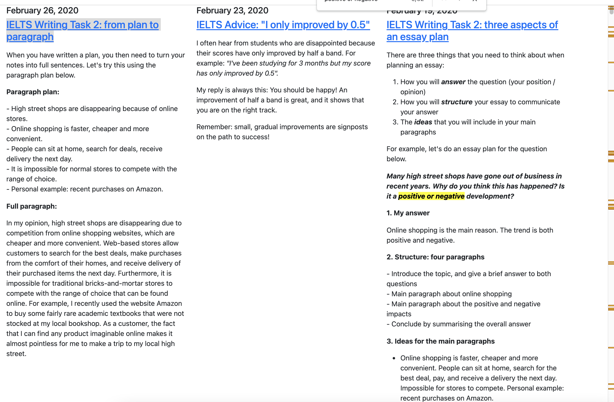
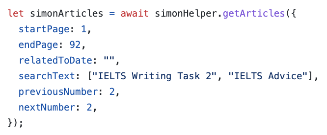

# parse-ielts-simon-app

App to parse [IELTS Simon website](https://www.ielts-simon.com/) and generate more convenient page.

You can easily search for specific key word and see related articles near by to get the overview of the concept that Mr. Simon wrote about.


## how to use

Clone this repo to your own profiles.

Edit the filter in `index.js`.


Then regenerate the `index.html` by running this command

```bash
npm start
```

Commit the changes and enjoy learning. _(remember to turn on github page on your cloned repo)_
